# ☕ Cafe Management & Billing System

A Java-based **Cafe Management & Billing System** developed using **Java, NetBeans, Java Swing, JDBC, and MySQL**.

The system is designed to simplify cafe operations by providing separate functionalities for **Administrators** and **Waiters**.

The **Admin** is responsible for managing waiters and viewing reports, while the **Waiter** manages the cafe menu, handles customer orders, and performs billing.

---

## 📌 Project Overview

The Cafe Management & Billing System provides a complete workflow for managing day-to-day cafe operations.

The system includes:

- Role-based access
- Admin authentication
- Waiter authentication
- Waiter management
- Menu management
- Order management
- Billing
- Reports
- MySQL database integration

The application helps reduce manual work and provides an organized interface for managing cafe activities.

---

# ✨ Features

## 👨‍💼 Admin Features

The Admin manages cafe staff and reports.

- Admin login
- Admin dashboard
- Add waiter
- Update waiter
- Delete waiter
- View reports
- Manage waiter information

---

## 🧑‍🍳 Waiter Features

The Waiter manages the cafe menu and handles customer orders and billing.

- Waiter login
- Waiter dashboard
- Add menu items
- Update menu items
- Delete menu items
- Manage cafe menu
- Take customer orders
- Manage customer orders
- Generate customer bills
- Complete billing process

---

## 🧾 Billing Features

- Customer order management
- Automatic bill calculation
- Unique Bill ID
- Bill timestamp
- Bill generation
- Print/export bill functionality

---

# 🛠️ Technologies Used

| Technology | Purpose |
|---|---|
| ☕ Java | Application development |
| 🖥️ NetBeans IDE | Development environment |
| 🎨 Java Swing | Graphical User Interface |
| 🔌 JDBC | Database connectivity |
| 🗄️ MySQL | Database management |
| 🔨 Apache Ant | Project build system |

---

# 📸 Screenshots

The following screenshots demonstrate the complete workflow of the Cafe Management & Billing System.

---

## 🏠 1. Home

The home page is the entry point of the application.

<table>
  <tr>
    <td align="center">
      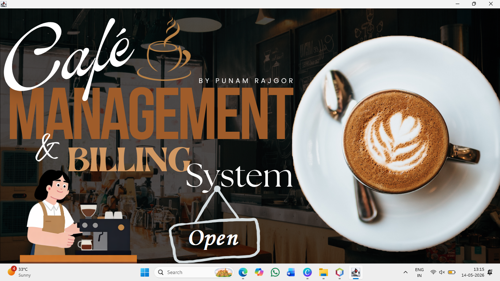
    </td>
  </tr>
</table>

---

## 👥 2. Role Selection

Users can select their role before accessing the system.

<table>
  <tr>
    <td align="center">
      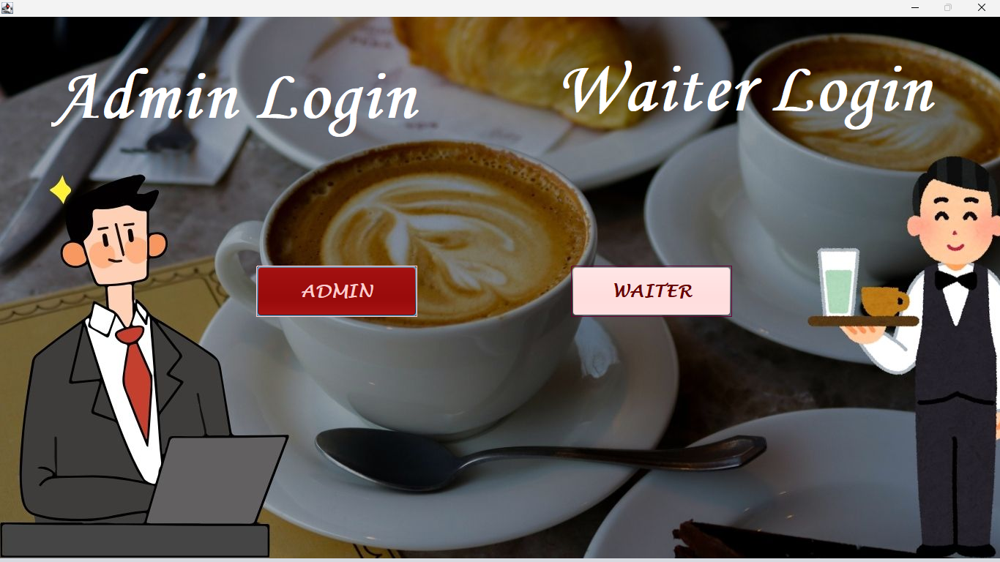
    </td>
  </tr>
</table>

---

# 👨‍💼 Admin Module

## 🔐 3. Admin Login

The administrator can log into the system using the admin login.

<table>
  <tr>
    <td align="center">
      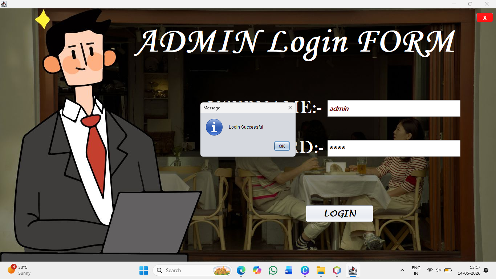
    </td>
  </tr>
</table>

---

## 👨‍💼 4. Admin Dashboard

The admin dashboard provides access to waiter management and reporting functionality.

<table>
  <tr>
    <td align="center">
      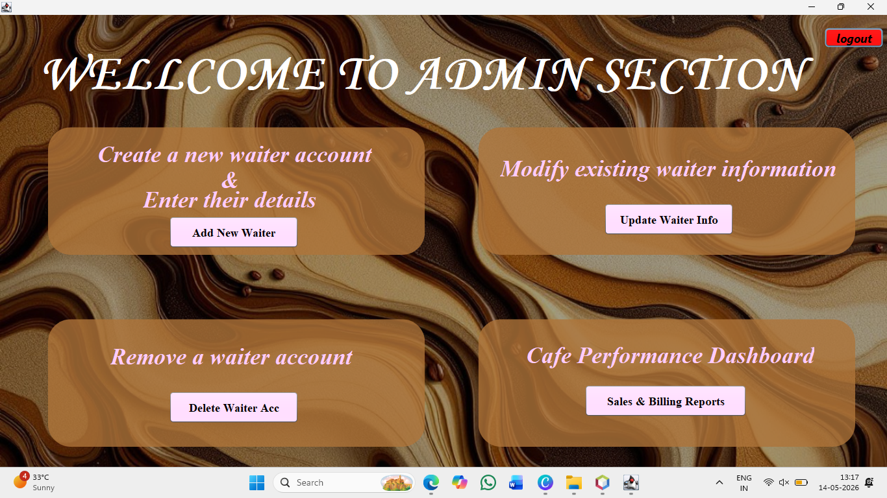
    </td>
  </tr>
</table>

---

## ➕ 5. Add Waiter

The administrator can add a new waiter to the system.

<table>
  <tr>
    <td align="center">
      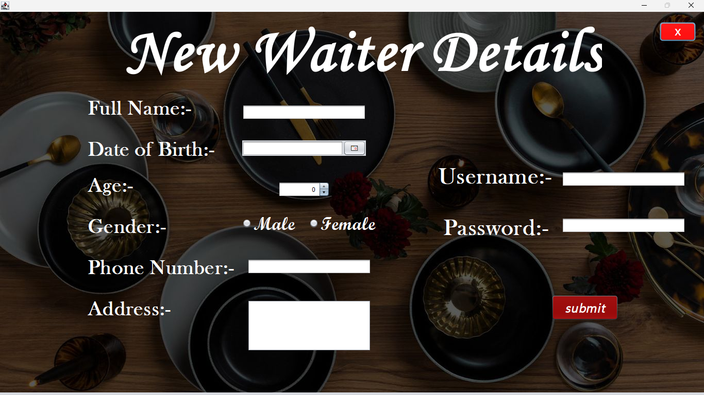
    </td>
  </tr>
</table>

---

## ✏️ 6. Update Waiter

The administrator can update existing waiter information.

<table>
  <tr>
    <td align="center">
      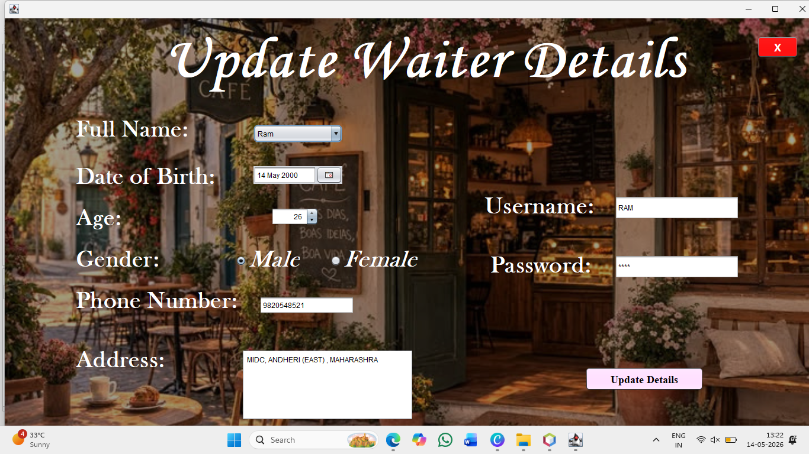
    </td>
  </tr>
</table>

---

## 🗑️ 7. Delete Waiter

The administrator can delete waiter accounts from the system.

<table>
  <tr>
    <td align="center">
      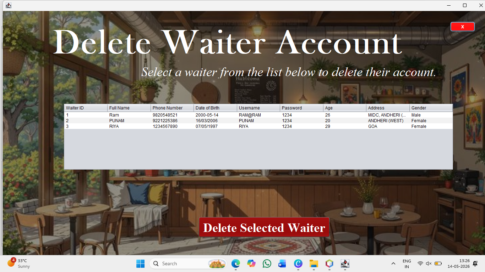
    </td>
  </tr>
</table>

---

## 📊 8. Reports

The administrator can view cafe-related reports.

<table>
  <tr>
    <td align="center">
      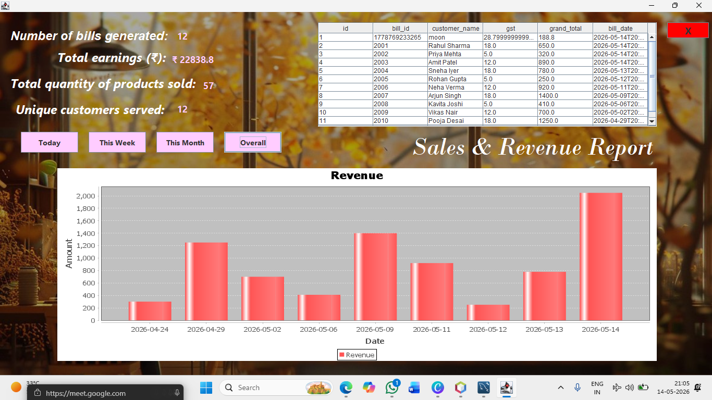
    </td>
  </tr>
</table>

---

# 🧑‍🍳 Waiter Module

## 🔐 9. Waiter Login

Waiters can log into the system using their credentials.

<table>
  <tr>
    <td align="center">
      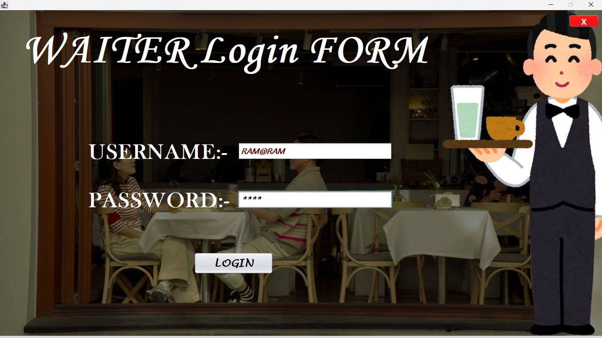
    </td>
  </tr>
</table>

---

## 🧑‍🍳 10. Waiter Dashboard

The waiter dashboard provides access to menu management and customer order operations.

<table>
  <tr>
    <td align="center">
      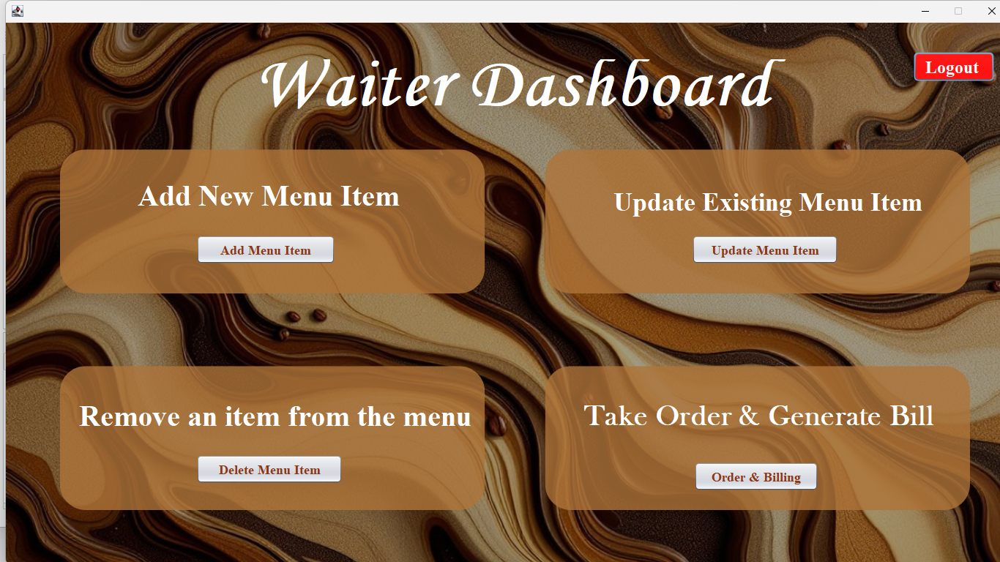
    </td>
  </tr>
</table>

---

# 🍽️ Menu Management

## ➕ 11. Add Menu

The waiter can add new items to the cafe menu.

<table>
  <tr>
    <td align="center">
      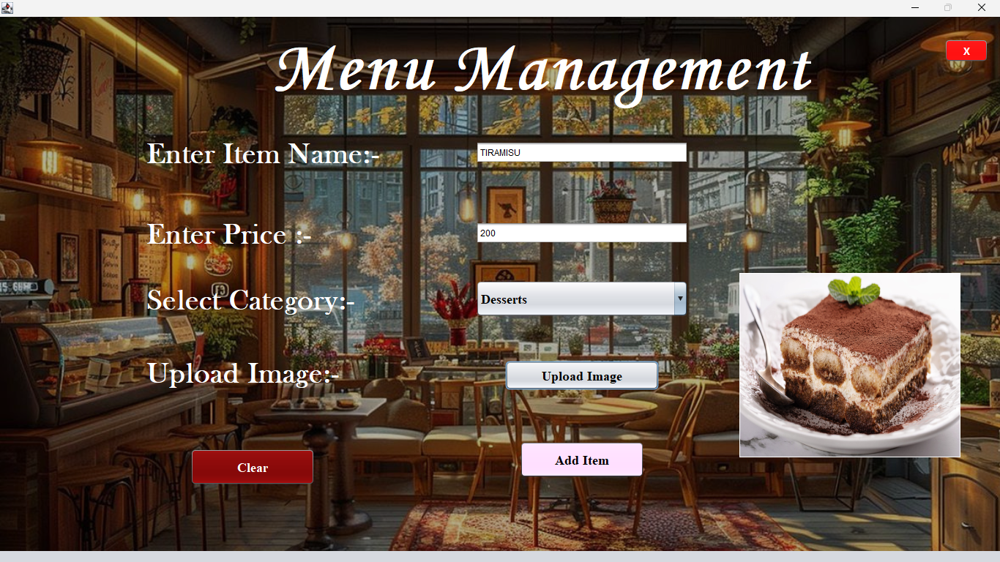
    </td>
  </tr>
</table>

---

## ✏️ 12. Update Menu

The waiter can update existing menu items.

<table>
  <tr>
    <td align="center">
      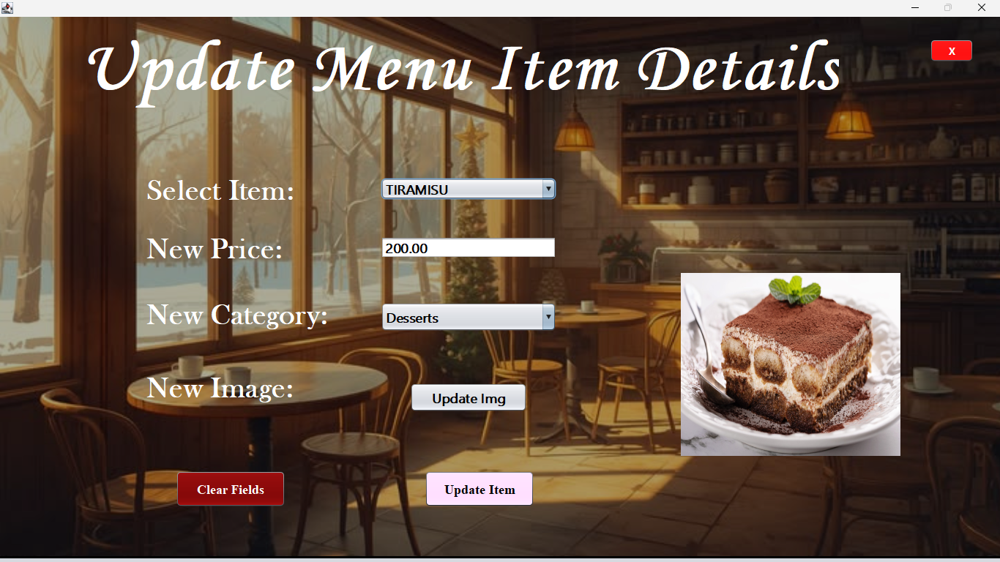
    </td>
  </tr>
</table>

---

## 🗑️ 13. Delete Menu

The waiter can remove menu items that are no longer available.

<table>
  <tr>
    <td align="center">
      
    </td>
  </tr>
</table>

---

# 🧾 Order & Billing

## 🛒 14. Order & Billing

The waiter can take customer orders, select menu items, calculate the total amount, and generate the final bill.

<table>
  <tr>
    <td align="center">
      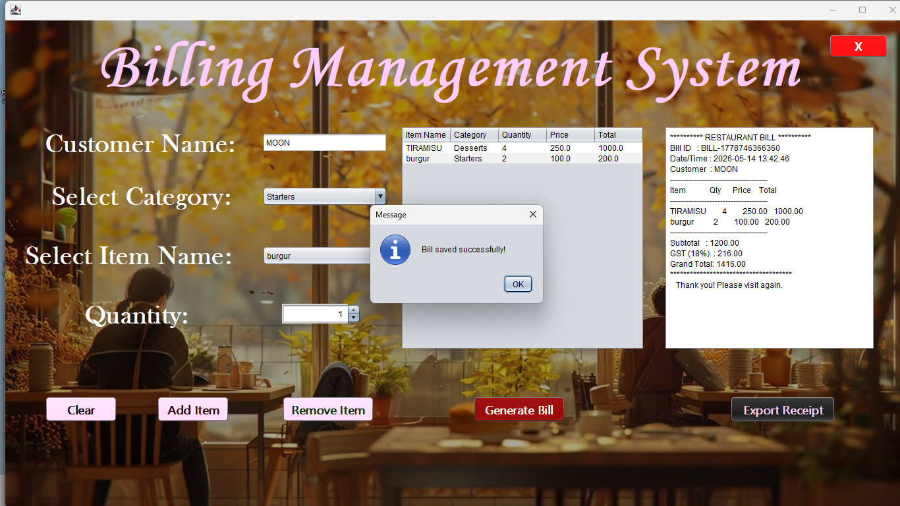
    </td>
  </tr>
</table>

---

# 🔄 System Workflow

```text
                         ┌───────────────┐
                         │     HOME      │
                         └───────┬───────┘
                                 │
                                 ▼
                         ┌───────────────┐
                         │ ROLE SELECTION│
                         └───────┬───────┘
                                 │
                  ┌──────────────┴──────────────┐
                  │                             │
                  ▼                             ▼
          ┌───────────────┐             ┌───────────────┐
          │ ADMIN LOGIN   │             │ WAITER LOGIN  │
          └───────┬───────┘             └───────┬───────┘
                  │                             │
                  ▼                             ▼
          ┌───────────────┐             ┌───────────────┐
          │    ADMIN      │             │    WAITER     │
          │   DASHBOARD   │             │   DASHBOARD   │
          └───────┬───────┘             └───────┬───────┘
                  │                             │
          ┌───────┼────────┐                    ▼
          │       │        │             ┌───────────────┐
          ▼       ▼        ▼             │     MENU      │
        Add    Update    Delete          └───────┬───────┘
       Waiter  Waiter    Waiter                   │
          │       │        │              ┌───────┼───────┐
          │       │        │              ▼       ▼       ▼
          │       │        │            Add    Update   Delete
          │       │        │            Menu    Menu     Menu
          │       │        │              │       │       │
          │       │        │              └───────┼───────┘
          │       │        │                      │
          │       │        │                      ▼
          │       │        │              ┌───────────────┐
          │       │        │              │ Order &       │
          │       │        │              │ Billing       │
          │       │        │              └───────┬───────┘
          │       │        │                      │
          └───────┴────────┘                      ▼
                  │                        Customer Bill
                  ▼
              📊 Reports
